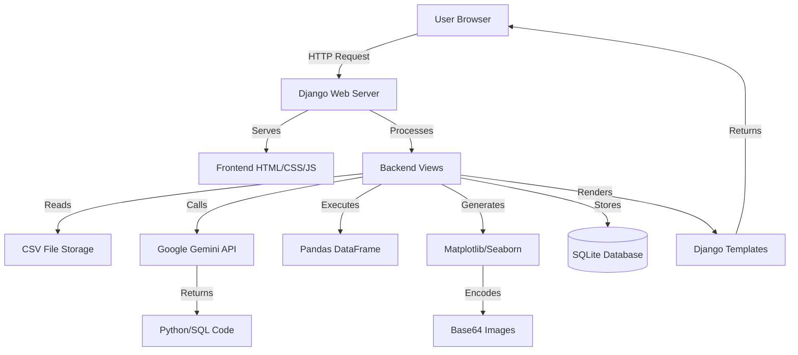
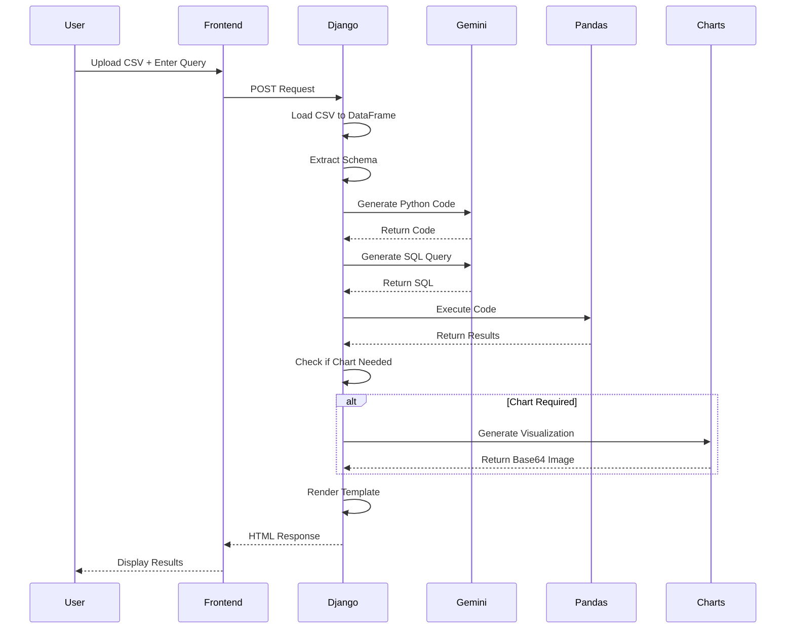

# Talk to Your Data - System Architecture

## 📐 Architecture Overview

This document describes the system architecture of the "Talk to Your Data" application, a Django-based web application that enables natural language querying of CSV data using AI.

---

## 🏛️ High-Level Architecture



---

## 🔧 System Components

### 1. Frontend Layer

#### Technology Stack
- **HTML5** - Semantic markup
- **CSS3** - Custom styling with CSS variables
- **Vanilla JavaScript** - Client-side interactivity

#### Key Components
- **Tabbed Interface** - Three-tab system for Output, Python Code, and SQL
- **Copy Functionality** - Clipboard API integration
- **File Upload** - HTML5 file input
- **Query Input** - Text-based natural language interface
- **History Sidebar** - Query history display

#### File Location
```
query_app/templates/query_app/index.html
```

---

### 2. Backend Layer

#### Django Application Structure

```
talk_to_your_data/
├── query_app/              # Main application
│   ├── models.py          # Data models
│   ├── views.py           # Business logic
│   ├── urls.py            # URL routing
│   └── templates/         # HTML templates
└── talk_to_your_data/     # Project settings
    ├── settings.py        # Configuration
    └── urls.py            # Root URLs
```

#### Core Views (`query_app/views.py`)

**1. `index(request)` - Main View**
- Handles GET and POST requests
- Manages file uploads
- Processes queries
- Renders results

**2. `generate_code(schema, question)` - Code Generation**
- Input: CSV schema + natural language question
- Process: Calls Gemini API
- Output: Python/pandas code

**3. `generate_sql_command(schema, question, df)` - SQL Generation**
- Input: Schema + question + DataFrame
- Process: Calls Gemini API
- Output: SQL query string

**4. `execute_generated_code(code, df)` - Code Execution**
- Input: Generated code + DataFrame
- Process: Executes in isolated environment
- Output: Result DataFrame or error

**5. `should_generate_chart(result_df, query_text)` - Chart Decision**
- Input: Result data + query text
- Process: Keyword detection + data analysis
- Output: Boolean decision

**6. `generate_chart(result_df, query_text)` - Chart Creation**
- Input: Result DataFrame + query text
- Process: Creates visualization using Matplotlib/Seaborn
- Output: Base64-encoded PNG image

**7. `download_csv(request)` - CSV Export**
- Input: Session data
- Process: Retrieves stored CSV data
- Output: HTTP response with CSV file

---

### 3. Data Layer

#### Database Models (`query_app/models.py`)

**DatasetUpload Model**
```python
class DatasetUpload(models.Model):
    file_name = CharField(max_length=255)
    upload_date = DateTimeField(default=timezone.now)
    row_count = IntegerField(null=True, blank=True)
    column_count = IntegerField(null=True, blank=True)
    columns = TextField()  # JSON string of column info
```

**QueryHistory Model**
```python
class QueryHistory(models.Model):
    dataset = ForeignKey(DatasetUpload)
    query_text = TextField()
    query_date = DateTimeField(default=timezone.now)
    python_code = TextField(blank=True)
    sql_command = TextField(blank=True)
    result_data = TextField(blank=True)
    has_chart = BooleanField(default=False)
    chart_image = TextField(blank=True)  # Base64
    execution_success = BooleanField(default=True)
    error_message = TextField(blank=True)
    execution_time_ms = IntegerField(null=True, blank=True)
```

#### Session Storage
- **CSV Data** - Stored in Django session
- **Query Results** - Temporary session storage
- **File Metadata** - Session-based tracking

---

### 4. AI Integration Layer

#### Google Gemini API

**Model Used**: `gemini-2.0-flash-exp`

**Integration Points**:

1. **Code Generation**
```python
model = genai.GenerativeModel('gemini-2.0-flash-exp')
response = model.generate_content(prompt)
```

2. **SQL Generation**
```python
model = genai.GenerativeModel('gemini-2.0-flash-exp')
response = model.generate_content(sql_prompt)
```

**Prompt Engineering**:
- Schema-aware prompts
- Context-specific instructions
- Output format specifications
- Error handling guidelines

---

### 5. Data Processing Layer

#### Pandas Integration

**Workflow**:
1. CSV Upload → `pd.read_csv()`
2. Schema Extraction → `df.dtypes`, `df.columns`
3. Code Execution → `exec()` with isolated globals
4. Result Processing → DataFrame manipulation

**Security Measures**:
- Isolated execution environment
- Limited global scope
- Error catching and handling

---

## 🔄 Request Flow

### Query Processing Flow



---

## 🗂️ Data Flow

### File Upload Flow

```
1. User selects CSV file
2. Frontend sends multipart/form-data
3. Django receives file
4. File saved to session
5. Pandas reads CSV
6. Schema extracted
7. Suggested questions generated
8. UI updated with file info
```

### Query Execution Flow

```
1. User enters natural language query
2. Django receives query text
3. Schema + Query → Gemini API
4. Gemini returns Python code
5. Code executed with Pandas
6. Results stored in session
7. SQL query generated (parallel)
8. Chart decision made
9. If needed, chart generated
10. All data passed to template
11. Template renders with tabs
12. User sees results
```

---

## 🔐 Security Architecture

### Input Validation
- CSV file type checking
- File size limits (Django settings)
- Query text sanitization

### Code Execution Safety
- Isolated execution environment
- Limited global scope (`pd`, `df` only)
- Exception handling
- Timeout protection (via Django)

### API Security
- API key stored in environment variables
- Not exposed to frontend
- Rate limiting (Gemini API side)

### Session Security
- Django session framework
- CSRF protection
- Secure cookie settings

---

## 📊 Chart Generation Architecture

### Decision Logic

```python
def should_generate_chart(result_df, query_text):
    # Keyword detection
    viz_keywords = ['show', 'compare', 'trend', 'distribution', 
                    'by', 'per', 'top', 'bottom']
    
    # Data suitability check
    is_suitable = len(result_df) > 1 and len(result_df) < 100
    
    return has_viz_keyword and is_suitable
```

### Chart Type Selection

```python
if categorical_cols and numeric_cols:
    # Bar chart
elif len(numeric_cols) >= 2:
    # Scatter plot
elif len(numeric_cols) == 1:
    # Histogram
else:
    # Default bar chart
```

### Rendering Pipeline

```
1. Matplotlib figure creation
2. Seaborn styling applied
3. Data plotted
4. Figure saved to BytesIO
5. Encoded to Base64
6. Embedded in HTML as data URI
```

---

## 🌐 Frontend Architecture

### Component Structure

```
index.html
├── Header Section
│   ├── Title
│   └── Description
├── Sidebar
│   ├── Logo
│   ├── App Name
│   └── Query History
├── Main Content
│   ├── File Upload Form
│   ├── Query Input
│   ├── Suggested Questions
│   └── Result Section
│       ├── Tab Navigation
│       ├── Output Tab
│       │   ├── Results Display
│       │   ├── Copy Button
│       │   └── Chart (if available)
│       ├── Python Code Tab
│       │   ├── Code Display
│       │   └── Copy Button
│       └── SQL Command Tab
│           ├── SQL Display
│           ├── Copy Button
│           └── Note
└── JavaScript Functions
    ├── File Upload Handler
    ├── Tab Switching
    ├── Copy to Clipboard
    └── History Click Handler
```

### State Management

**Client-Side State**:
- Active tab (CSS classes)
- Copy button state (temporary)
- File selection state

**Server-Side State** (Session):
- Uploaded CSV data
- Current DataFrame
- Query history
- Last query results
- Generated code
- Chart data

---

## 🔄 Session Management

### Session Data Structure

```python
request.session = {
    'csv_data': <CSV content>,
    'file_name': 'data.csv',
    'df_columns': ['col1', 'col2', ...],
    'query_history': ['query1', 'query2', ...],
    'csv_export_data': <CSV string>,
    'last_query': 'What is the total?',
    'last_result': <DataFrame as string>
}
```

### Session Lifecycle

1. **Upload**: CSV data stored
2. **Query**: Results added
3. **History**: Queries appended
4. **Export**: CSV data prepared
5. **Cleanup**: Django handles expiration

---

## 📈 Scalability Considerations

### Current Limitations
- In-memory DataFrame processing
- Session-based storage
- Single-threaded execution
- SQLite database

### Future Enhancements
- Database-backed data storage
- Async query processing
- Redis for session management
- PostgreSQL for production
- Celery for background tasks
- File size limits and pagination

---

## 🧪 Testing Architecture

### Test Coverage Areas

1. **Unit Tests**
   - Code generation functions
   - SQL generation functions
   - Chart decision logic
   - Data processing functions

2. **Integration Tests**
   - Full query flow
   - File upload process
   - Chart generation pipeline

3. **Frontend Tests**
   - Tab switching
   - Copy functionality
   - Form submission

---

## 📦 Deployment Architecture

### Development Environment
```
Local Machine
├── Django Dev Server (port 8000)
├── SQLite Database
└── File System Storage
```

### Production Recommendations
```
Production Server
├── Gunicorn/uWSGI
├── Nginx (Reverse Proxy)
├── PostgreSQL Database
├── Redis (Session Store)
├── Static Files (CDN)
└── SSL/TLS Certificate
```

---

## 🔧 Configuration Management

### Environment Variables
```env
GEMINI_API_KEY=<api_key>
DEBUG=True/False
SECRET_KEY=<django_secret>
ALLOWED_HOSTS=localhost,domain.com
DATABASE_URL=<db_connection>
```

### Django Settings Structure
```python
settings.py
├── BASE_DIR
├── SECRET_KEY
├── DEBUG
├── ALLOWED_HOSTS
├── INSTALLED_APPS
├── MIDDLEWARE
├── DATABASES
├── STATIC_URL
└── SESSION_ENGINE
```

---

## 📊 Performance Considerations

### Optimization Strategies

1. **Caching**
   - Query result caching
   - Chart caching
   - Schema caching

2. **Lazy Loading**
   - Deferred chart generation
   - Paginated results

3. **Resource Management**
   - DataFrame memory cleanup
   - Session data limits
   - File size restrictions

---

## 🎯 Design Patterns Used

1. **MVC Pattern** - Django's MVT (Model-View-Template)
2. **Factory Pattern** - Chart type selection
3. **Strategy Pattern** - Different chart generation strategies
4. **Template Method** - Query processing pipeline
5. **Singleton Pattern** - Gemini API client

---

## 📝 Summary

This architecture provides:
- ✅ Clean separation of concerns
- ✅ Scalable component structure
- ✅ Secure data handling
- ✅ Extensible design
- ✅ Maintainable codebase

The system is designed to be simple yet powerful, with clear pathways for future enhancements and scaling.
